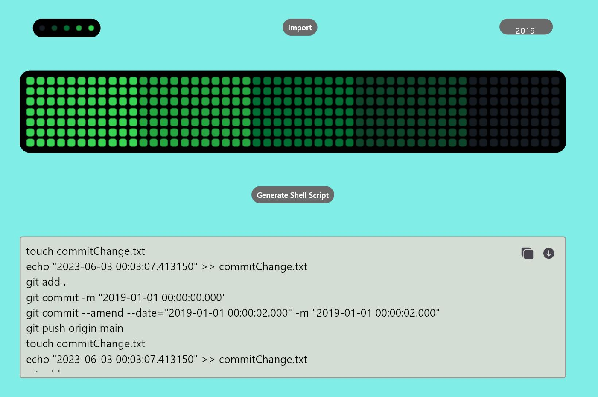

# GitHub Painter
[](LICENSE)

GitHub Painter is a Flutter project that allows users to create art in their GitHub contribution grid, both in past and future dates. With this tool, you can paint directly onto your contribution grid or import any image, which will be automatically converted to the grid format and visually displayed before committing the changes.




## Installation

To use install the GitHub Painter, please follow these steps:

1. Clone the repository:
   ```sh
   git clone https://github.com/TalentedB/GitHub-Painter.git
   ```

2. Change to the project directory:
   ```sh
   cd GitHub-Painter
   ```

3. Ensure you have [Flutter installed on your system](https://docs.flutter.dev/get-started/install).

## Usage

Once the installation is complete, you can run the project on an emulator or a physical device using the following command(s):

For debug mode:
```sh
flutter run
```

For profile mode (runs without debug tools for increased performance):
```sh
flutter run --profile
```

The GitHub Painter application will open, allowing you to start creating art on your GitHub contribution grid. Here's a brief overview of the available features:

### Painting on the Grid

You can directly paint on the grid by selecting a date and choosing a color. Simply select the color you want to use and draw anything you want!

### Importing Images

GitHub Painter also supports importing images to convert them into the grid format. To import an image, follow these steps:

1. Tap on the "Import" button.
2. Select the desired image from your device's gallery.
3. The image will be automatically converted into the grid format and displayed on the screen.
4. Confirm the changes, and the corresponding dates on the grid will be updated with the image colors.

### Exporting Shell Script

GitHub Painter allows you to easily transform your beautiful art into a shell script that can be run to paint the displayed pixel-art onto your GitHub contribution graph.

### Drawing to Contribution Grid

Once you are satisfied with your artwork, you can commit the changes to your GitHub contribution grid. To commit the changes, follow these steps:

1. Ensure you're GitHub account is configured properly to the account you want to draw on.
2. Clone a repoistory you would like to use to draw your art in.
3. Save the shell script into that repo clone and execute it.
4. It should take a bit but you will obtain a beautiful piece of art on your page.

Please note that committing changes will update your actual GitHub contribution grid, so make sure you are satisfied with your artwork before proceeding.

*(You are able to hide or remove the art by deleting the repo if need arises.)*

## Contributions

Contributions to GitHub Painter are welcome! If you encounter any bugs, have suggestions for new features, or would like to contribute in any way, please feel free to open an [issue](https://github.com/TalentedB/GitHub-Painter/issues) or submit a [pull request](https://github.com/TalentedB/GitHub-Painter/pulls).

## License

This project is licensed under the [MIT License](LICENSE).

